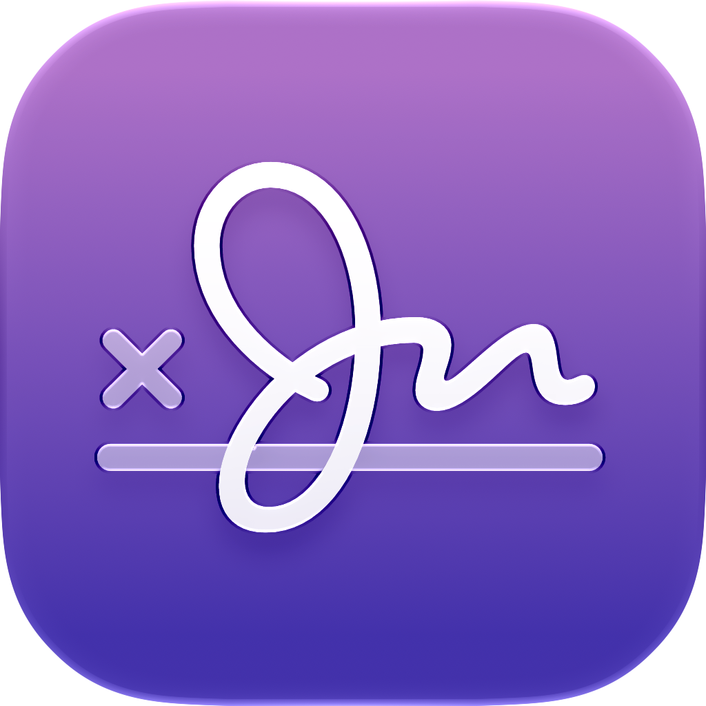
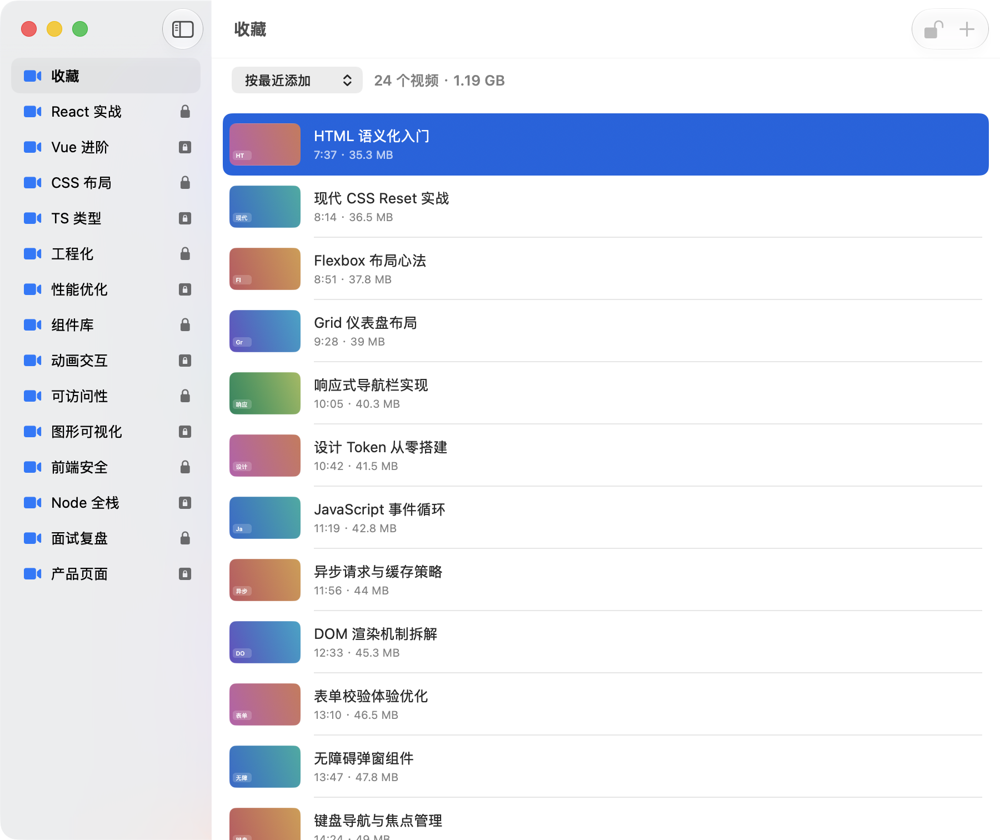

<p align="center">
  
</p>

<h1 align="center">Crypta</h1>

<p align="center">
  A native encrypted media library for macOS.<br>
  Organize videos and images in vaults, store them locally with encryption, tiered access control, and a polished app window.
</p>


<p align="center">
  <a href="https://github.com/imeelinew/Crypta/releases">Download</a> ·
  <a href="#install">Install</a> ·
  <a href="#build-from-source">Build from source</a>
</p>

<p align="center">
  <a href="README.en.md">English</a>
  <a href="README.md">简体中文</a>
</p>

<p align="center">
  <a href="https://github.com/imeelinew/Crypta/releases/latest"></a>
  
  
  <a href="LICENSE"></a>
</p>

---

<p align="center">
  
</p>

## About

Crypta is an elegant, native macOS encrypted media library for people who want to keep videos and images on their Mac, organized by topic or purpose, with real access control.

A sidebar holds multiple vaults, each with its own encryption level and media type. Unlock with Touch ID or your system password when needed. Playback and preview run in controlled temporary sessions, and vaults lock again when you switch away or leave the app.

## Why Crypta

Photos and Finder folders can store files, but they do not combine grouping, encryption, tiered access, and safe playback in one lightweight tool. Crypta does.

- **Vault groups**: create separate vaults for courses, projects, or any purpose; videos and images are managed separately.
- **Tiered access control**: choose standard, extended, or maximum encryption—device authentication, lock on switch, and lock on app resign as needed.
- **Local encrypted storage**: media and index live in `Movies/Crypta.vault`; keys stay in Keychain.
- **Safe playback and preview**: protected vaults use a built-in player with automatic privacy overlay; Quick Look space-bar preview is supported.
- **Import and organize**: drag-and-drop or file picker import, plus rename, sort, search, encrypt, and decrypt export.

## Vaults

When creating a vault, you choose:

- **Access control level**
  - **Standard encryption**: files are encrypted on import; browse and play without extra authentication.
  - **Extended encryption**: Touch ID / password required to view; manual lock and delayed auto-lock on app resign.
  - **Maximum encryption**: authentication every time; immediate lock on vault switch or app resign.
- **Media type**: video or image, each with its own supported import formats.

## Playback and Preview

- **Video**: standard vaults use the system default player; protected vaults use the built-in player with resume position.
- **Images**: decrypted into a temporary session and opened with an external app such as Pixea.
- **Quick Look**: press Space on a selected item, or preview thumbnails in the list.
- **Privacy protection**: the player pauses and covers the frame when the app resigns active or the vault locks.

## More Features

- Video and image lists with thumbnails
- Drag-and-drop import and multi-select batch actions
- One-click encryption for plain files already in the library
- Decrypt and export to a folder (removed from the vault after export)
- Index backup and data-safety test scripts
- Frosted-glass window styling aligned with macOS 26

## Install

Download the latest release from the [Releases page](https://github.com/imeelinew/Crypta/releases), then move `Crypta.app` to `/Applications`.

## Build from source

Requires Xcode and macOS 26.5 or later.

```bash
git clone https://github.com/imeelinew/Crypta.git
cd Crypta
open Crypta.xcodeproj
```

Select the **Crypta** scheme in Xcode, then **Product → Run**.

## License

This project is licensed under the [MIT License](LICENSE).
